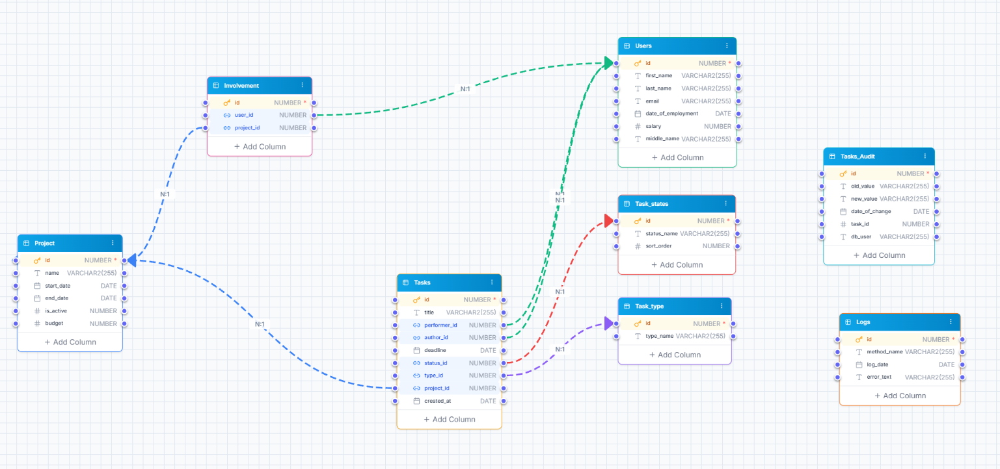

# README

## Oracle PL/SQL

---

## Структура проекта

- `00_drop.sql` — Удаление всех объектов
- `01_create_database.sql` — Создание таблиц и индексов
- `02_insert.sql` — Справочные данные (статусы, типы задач)
- `03_sequences_triggers.sql` — Последовательности, триггеры (ID, аудит, запрет смены исполнителя)
- `04_procedures.sql` — Бизнес-процедуры
- `05_test_data.sql` — Тестовые данные
- `06_functions.sql` — Функция фильтрации задач
- `07_reports.sql` — 5 аналитических отчётов (VIEW)
- `08_tests.sql` — Тесты

---

## Схема БД

- `E_Users` — пользователи
- `E_Project` — проекты
- `E_Involvement` — принадлежность пользователей к проектам
- `E_Tasks` — задачи
- `E_Task_states` — статусы задач
- `E_Task_Type` — типы задач
- `E_Tasks_Audit` — аудит изменений задач
- `E_Logs` — логирование ошибок

---

## Процедуры

- `assign_user_to_project` — назначение пользователя на проект
- `create_task` — создание задачи
- `assign_performer` — назначение исполнителя на задачу
- `change_status` — смена статуса задачи

---

## Функция

- `get_tasks_by_filter(p_user_id, p_project_id, p_performer_id, p_status_id)` — список задач по фильтру (с учётом прав доступа)

---

## Отчёты (VIEW)

- `v_report_overdue_tasks` — Задачи с просроченным дедлайном
- `v_report_tasks_by_performer` — Кол-во задач по исполнителям в разрезе статусов
- `v_report_unfinished_tasks` — Невыполненные задачи («Создано», «В работе»)
- `v_report_users_without_tasks` — Пользователи на проекте без задач
- `v_report_top3_performers` — Топ-3 исполнителя за последний месяц
  

